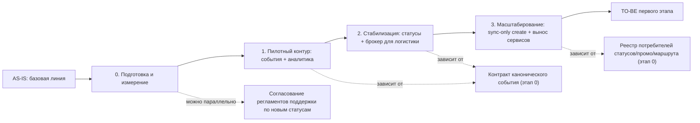

# migration-roadmap.md — roadmap инкрементальной миграции

> Назначение документа: показать безопасный путь от AS-IS к TO-BE через промежуточные состояния, зависимости, риски, условия остановки и критерии завершения этапов.

## 0. Паспорт roadmap

| Поле | Значение |
|---|---|
| Название проекта | RetailCore — наведение порядка в данных, событиях и статусах заказа (Horizon 1) |
| Связанный документ трансформации | `transformation.md` |
| Горизонт планирования | Первый релиз / ~2–3 квартала. Ядро checkout, ценообразование и оркестрация оплаты в этот горизонт сознательно не входят — это отдельная, более рискованная программа следующего горизонта |
| Выбранная стратегия миграции | Incremental Migration (Strangler Fig для периферийной логики монолита) в сочетании с Parallel Run на рискованных переходах |
| Ключевые паттерны | Event-Driven Architecture (Outbox/CDC), Strangler Fig, Anti-Corruption Layer (контракты статуса/маршрута для внешних партнёров), Database Decomposition (вынос аналитики в отдельное хранилище) |
| Автор | Иван, слушатель курса по архитектуре решений |
| Дата | 2026-07-01 |
| Версия | 0.1 |

## 1. Краткое резюме roadmap

Миграция выполняется инкрементально, потому что бизнес прямо ограничил единовременную замену: нельзя останавливать checkout, нельзя одномоментно менять правила работы для всех команд и партнёров, а часть логики скрыто живёт в Oracle-процедурах — её объём заранее неизвестен. Сначала команда фиксирует базовую линию метрик и инвентаризирует скрытую логику (Oracle-процедуры, batch, ручные исключения), затем строится первый безопасный переход — канонический слой бизнес-событий заказа и доставки, публикуемый из монолита без изменения транзакции оформления, и на нём же снимается самая тяжёлая аналитическая нагрузка с операционной Oracle. После этого сценарий стабилизируется: вводится единая статусная модель (техническая для поддержки + отображение для пользователя) и обмен с логистикой переводится с таблиц на брокер сообщений. И только затем решение масштабируется: создание заказа остаётся синхронным только до состояния «создан», остальной поток становится асинхронным, а промо-логика, чтение статусов и выбор маршрута выносятся из монолита как отдельные сервисы. Такой порядок продиктован зависимостями: единой статусной модели и вынесенным сервисам нужен канонический поток событий как источник; переходу на брокер для логистики нужен согласованный контракт события и идемпотентность; аналитическому оффлоаду нужен CDC/outbox как источник, а не наоборот. Основные риски roadmap связаны с недооценкой скрытой логики в Oracle, с потерей прозрачности для поддержки во время перехода и с дублированием/рассинхроном событий при переходе на брокер — поэтому для каждого этапа заданы критерии готовности, метрики и условия остановки, а два самых рискованных перехода (логистика: таблицы → брокер; аналитика: Oracle → Clickhouse) вынесены в отдельные cutover-планы. Ядро checkout, оплаты и полный расчёт цены в этом горизонте не трогаются намеренно — это прямое требование бизнеса и техлида.

## 2. Стартовое и целевое состояние

| Состояние | Описание | Ключевые ограничения | Метрики / признаки состояния |
|---|---|---|---|
| AS-IS | Монолит — центральный оркестратор оформления заказа. Нет единого источника правды: цена/промо считаются минимум тремя механизмами, статусы не централизованы, логистика подключена смесью REST/очередей/таблиц/batch, аналитика читает несколько «почти канонических» витрин напрямую из Oracle | Часть логики живёт в Oracle-процедурах и не видна на схемах; высокая связность мешает выносу функций; наблюдаемость асимметрична | P95 создания заказа не измеряется единообразно; расхождения цифр между маркетингом/финансами/операциями регулярны; объём обращений в поддержку по «непонятному статусу» высокий |
| Промежуточное состояние 1 (после этапов 0–1) | Появился канонический слой бизнес-событий (outbox/CDC из монолита, без изменения транзакции оформления); аналитика читает тяжёлые отчёты из отдельной БД (Clickhouse), а не из операционной Oracle | Checkout и статусная модель ещё старые; логистика ещё частично идёт через таблицы; fallback-логика промо не изменена | Доля тяжёлых аналитических запросов на операционной Oracle снижена; расхождение цифр Oracle vs Clickhouse ниже согласованного порога |
| Промежуточное состояние 2 (после этапа 2) | Единая статусная модель для поддержки с явными «неуспешными» ветками и отображением в пользовательский статус; обмен статусами доставки с логистикой идёт через брокер для приоритетных партнёров, обмен через таблицы для них выключен | Часть партнёров ещё на обмене через таблицы; создание заказа всё ещё тянет синхронные вызовы логистики | Снижение числа обращений «что со статусом заказа»; снижение среднего времени разбора обращения; доля дублей заявок к логистике ниже порога |
| TO-BE первого этапа (после этапа 3) | Создание заказа синхронно только до статуса «создан», остальной поток — асинхронно через брокер; промо-логика (не fallback-исключения), чтение статусов и выбор маршрута вынесены из монолита как отдельные сервисы, читающие канонический поток событий; обмен через таблицы Oracle для логистики полностью выключен | Полный расчёт цены, платёжная оркестрация и core order create остаются в монолите — это следующий горизонт | P95 создания заказа снижен и стабилен в пиковые окна; инциденты в периферийных сервисах не влияют на создание заказа; единая картина по бизнес-событиям у аналитики |

## 3. Принципы построения roadmap

- **Сначала измеряем, потом меняем:** baseline P95 создания заказа, объём и время разбора обращений поддержки по статусам/срокам доставки, частота расхождений цифр между отделами, частота дублей заявок к логистике, перечень Oracle-процедур/пакетов с реальной бизнес-логикой.
- **Сначала изолируем риск, потом расширяем сценарий:** канонический слой событий строится как append-only публикация (outbox/CDC) рядом с существующей транзакцией оформления, не заменяя и не блокируя её; только после того как поток событий подтверждённо надёжен, на него переводятся статусы и интеграции.
- **Сначала управляемый пилот, потом масштабирование:** аналитический оффлоад и переход логистики на брокер сначала обкатываются на одном-двух отчётах / одном-двух партнёрах с parallel run, и только после подтверждения эквивалентности расширяются на все.
- **Сначала модель состояний, потом коммуникация:** сначала согласуется единая статусная модель для поддержки (с ветками неуспешных сценариев) и правило отображения в пользовательский статус, и только потом это выкатывается в личный кабинет, уведомления и интерфейсы оператора.
- **Сначала реестр потребителей данных, потом декомпозиция:** перед вынесением промо-логики, чтения статусов и выбора маршрута собирается реестр всех потребителей текущей логики и данных (batch-джобы, административные экраны, специфичные ветки маркетплейсов) — так как ранее любой вынос компонента вытягивал скрытые зависимости.

## 4. Roadmap миграции

| Этап | Цель | Промежуточное состояние | Основные работы | Зависимости | Риски | Критерии завершения |
|---|---|---|---|---|---|---|
| AS-IS | Зафиксировать стартовую точку | Текущий монолит-оркестратор, три параллельных механизма цены/промо, нецентрализованные статусы, интеграции через REST/очереди/таблицы/batch | Собрать as-is-analysis.md, зафиксировать baseline-метрики | — | Риск неизвестности: часть логики не видна снаружи (Oracle-процедуры) | Baseline подтверждён с техлидом, логистикой, аналитикой, поддержкой и бизнесом |
| 0. Подготовка и измерение | Снять неизвестность перед первым изменением | Есть инвентаризация скрытой логики и согласованный черновик контракта событий | Инвентаризация Oracle-процедур/пакетов и batch-джобов; каталог fallback-исключений промо; реестр потребителей статусов/маршрута/промо; согласование чернового контракта канонического бизнес-события заказа/доставки с аналитикой, логистикой и поддержкой; внедрение сквозных correlation ID там, где их нет | — | Инвентаризация окажется неполной и вскроется позже | Список Oracle-процедур с бизнес-логикой согласован с DBA и техлидом; черновик контракта событий одобрен тремя командами-потребителями |
| 1. Пилотный контур | Построить канонический поток событий и снять тяжёлую аналитику с операционной Oracle | Событие заказа/доставки публикуется в поток (outbox/CDC), не влияя на транзакцию оформления; 1–2 самых тяжёлых аналитических отчёта читаются из Clickhouse | Реализовать outbox/CDC из монолита; поднять Clickhouse (или аналог) и пайплайн репликации; перевести пилотные отчёты; запустить parallel run Oracle vs Clickhouse | Этап 0 (контракт событий, инвентаризация) | CDC создаёт дополнительную нагрузку на Oracle в пик; рассинхрон между Oracle и Clickhouse | Расхождение Oracle vs Clickhouse по пилотным отчётам ниже согласованного порога 2 отчётных цикла подряд; P95 создания заказа не деградировал |
| 2. Стабилизация сценария | Дать поддержке и пользователю понятную и единую статусную картину; снять логистику с обмена через таблицы там, где риск ниже | Единая статусная модель (техническая + пользовательская) работает параллельно со старой; приоритетные партнёры логистики переведены с таблиц на брокер | Спроектировать и внедрить статусную модель с ветками неуспешных сценариев поверх канонического потока событий; построить единую карточку/таймлайн заказа для поддержки; внедрить брокер сообщений для статусов доставки; отключить обмен через таблицы для пилотных партнёров с parallel run | Этап 1 (поток событий как источник статусов); контракт статуса доставки | Потеря прозрачности для поддержки во время двойного запуска старой/новой модели; дубли заявок при переходе на брокер (идемпотентность) | Обращения «что со статусом заказа» не растут в период двойного запуска; дубли заявок к логистике ниже порога; поддержка подтверждает, что новая карточка не хуже старой |
| 3. Расширение / масштабирование | Сделать создание заказа синхронным только до «создан», остальное — асинхронно; вынести периферийную логику из монолита | Создание заказа синхронно только до статуса «создан»; промо-логика (не fallback), чтение статусов и выбор маршрута — отдельные сервисы; обмен через таблицы для логистики выключен полностью | Убрать синхронные вызовы логистики из транзакции создания заказа, заменить на асинхронную публикацию через брокер; вынести сервис чтения статусов, сервис промо-логики (для нормального, не fallback-сценария) и сервис выбора маршрута, опираясь на реестр потребителей из этапа 0 | Этап 2 (статусная модель и брокер стабильны); реестр потребителей (этап 0) | Скрытые зависимости (batch/админ-сценарии/старые API маркетплейсов), не учтённые в реестре, ломаются при выносе | Ни один критический сценарий checkout (конверсия, P95 создания заказа) не деградировал; вынесенные сервисы работают под нагрузкой пикового периода без отката |
| TO-BE первого этапа | Проверить достижение целевого состояния горизонта | Канонический поток событий, единая статусная модель, аналитика на отдельной БД, вынесенные периферийные сервисы, checkout-ядро сознательно не тронуто | Финальная сверка метрик с бизнесом, поддержкой, аналитикой; ретроспектива по инцидентам за горизонт; формирование бэклога следующего горизонта (ценообразование, оплата, core order create) | Завершённые этапы 0–3 | Остаточный риск: расчёт цены и оркестрация оплаты остаются в монолите | Целевые метрики раздела 8 достигнуты; бизнес подтверждает промежуточную ценность каждого этапа |

## 5. Детализация этапов

### Этап 0. Подготовка и измерение

| Раздел | Содержание |
|---|---|
| Цель этапа | Снять неизвестность: понять, сколько реальной логики скрыто в Oracle и у кого какие ожидания от контракта событий, прежде чем что-то менять |
| Какие точки трансформации закрывает | Подготовительная часть точки 1 (согласование модели событий) |
| Что меняется в процессе | Для пользователей и операторов — ничего не меняется. Для команд — появляется общий реестр скрытой логики и потребителей |
| Что меняется в архитектуре | Ничего не разворачивается в проде; готовятся артефакты (инвентаризация, контракт) |
| Что не меняется | Транзакция оформления заказа, статусная модель, интеграции |
| Входные условия | Доступ к Oracle-процедурам/пакетам для инвентаризации; участие техлида, логистики, аналитики, поддержки |
| Выходные условия | Согласованный список Oracle-процедур с бизнес-логикой; согласованный черновик контракта канонического события; реестр потребителей статусов/промо/маршрута |
| Метрики этапа | Baseline P95 создания заказа; baseline объём и время разбора обращений поддержки; baseline частота расхождений отчётности |
| Риски этапа | Инвентаризация окажется неполной (часть логики всплывёт позже) |
| Условие остановки | Ключевые команды (техлид, логистика, аналитика) не согласовали контракт события — дальше не двигаемся, дорабатываем контракт |

### Этап 1. Пилотный контур

| Раздел | Содержание |
|---|---|
| Цель этапа | Создать канонический поток бизнес-событий и снять самую тяжёлую аналитическую нагрузку с операционной Oracle |
| Какие точки трансформации закрывает | Точка 1 (единый канонический слой событий) — базовая версия; точка 4 (снять тяжёлые выгрузки с Oracle) — пилотная версия |
| Что меняется в процессе | Для аналитиков — часть отчётов теперь читается из отдельной БД. Для пользователей и поддержки — ничего не меняется |
| Что меняется в архитектуре | Появляется outbox/CDC из монолита; появляется Clickhouse (или аналог) и пайплайн репликации |
| Что не меняется | Транзакция оформления заказа (событие публикуется рядом, не внутри критического пути); статусная модель; интеграции с логистикой |
| Входные условия | Согласованный контракт события (этап 0); готовность аналитики к parallel run |
| Выходные условия | 1–2 пилотных отчёта переведены на Clickhouse и подтверждены как эквивалентные Oracle |
| Метрики этапа | Расхождение Oracle vs Clickhouse по пилотным отчётам; P95 создания заказа (не должен деградировать) |
| Риски этапа | Дополнительная нагрузка CDC на Oracle в пик; рассинхрон данных |
| Условие остановки | Расхождение Oracle vs Clickhouse выше согласованного порога дольше одного отчётного цикла — откатываемся на старый источник для отчёта |

### Этап 2. Стабилизация сценария

| Раздел | Содержание |
|---|---|
| Цель этапа | Дать поддержке и пользователю единую и понятную статусную картину; начать разгружать обмен с логистикой от таблиц |
| Какие точки трансформации закрывает | Точка 3 (статусная модель); частично точка 2 (убрать обмен через БД — для статусов доставки) |
| Что меняется в процессе | Оператор поддержки видит единый таймлайн заказа вместо хождения по системам; пользователь получает статус, отображённый из единой модели |
| Что меняется в архитектуре | Статусная модель строится поверх канонического потока событий; для приоритетных партнёров логистики обмен статусами переходит с таблиц на брокер |
| Что не меняется | Создание заказа всё ещё синхронно вызывает логистику; промо и выбор маршрута ещё в монолите |
| Входные условия | Стабильный поток событий (этап 1); согласованный контракт статуса доставки |
| Выходные условия | Новая статусная модель работает параллельно со старой без потери прозрачности; пилотные партнёры переведены на брокер |
| Метрики этапа | Число обращений «что со статусом заказа»; среднее время разбора обращения; доля дублей заявок к логистике |
| Риски этапа | Временная потеря прозрачности для поддержки во время двойного запуска; дубли из-за неидемпотентной обработки при переходе на брокер |
| Условие остановки | Обращения в поддержку или время их разбора растут во время двойного запуска — откат на старую модель, разбор причины |

### Этап 3. Расширение / масштабирование

| Раздел | Содержание |
|---|---|
| Цель этапа | Сделать создание заказа синхронным только до «создан»; вынести промо-логику, чтение статусов и выбор маршрута из монолита |
| Какие точки трансформации закрывает | Точка 2 (полностью — обмен через БД убран, синхронно только создание заказа); точка 5 (вынос промо-логики, чтения статусов, выбора маршрута) |
| Что меняется в процессе | Для пользователя — быстрее подтверждение заказа. Для логистики — все партнёры работают через брокер. Для команд — периферийная логика физически в отдельных сервисах |
| Что меняется в архитектуре | Синхронная транзакция создания заказа не вызывает логистику напрямую; появляются отдельные сервисы: чтение статусов, промо-логика (нормальный сценарий), выбор маршрута |
| Что не меняется | Полный расчёт цены, платёжная оркестрация, core order create остаются в монолите — сознательно, следующий горизонт |
| Входные условия | Стабильная статусная модель и брокер (этап 2); согласованный реестр потребителей (этап 0) |
| Выходные условия | Все партнёры логистики на брокере; обмен через таблицы выключен; вынесенные сервисы работают под пиковой нагрузкой без деградации checkout |
| Метрики этапа | P95 создания заказа; стабильность вынесенных сервисов; отсутствие влияния инцидентов периферийных сервисов на создание заказа |
| Риски этапа | Скрытые зависимости, не попавшие в реестр потребителей (batch, админ-сценарии, старые API маркетплейсов) |
| Условие остановки | Любая деградация конверсии или P95 создания заказа при выносе — откат конкретного выносимого куска через feature flag |

## 6. Зависимости между этапами

### 6.1. Таблица зависимостей

| Зависимость | Почему порядок жёсткий | Что будет, если нарушить порядок | Как контролируем |
|---|---|---|---|
| Этап 0 до этапа 1 | Без согласованного контракта события и инвентаризации Oracle-логики пилот на аналитике рискует унести в Clickhouse неполную или неверно интерпретированную модель | Расхождения цифр между Oracle и Clickhouse, повтор той же проблемы, что и сейчас, только в новом хранилище | Ревью контракта события с аналитикой, логистикой, поддержкой перед стартом этапа 1 |
| Этап 1 до этапа 2 | Единая статусная модель и брокер для логистики строятся как потребители канонического потока событий; без надёжного потока не на чем строить статусы | Статусная модель окажется такой же нецентрализованной, как сейчас, просто с новым источником данных | Метрика расхождения Oracle vs Clickhouse должна быть в норме минимум 2 цикла до старта этапа 2 |
| Этап 2 до этапа 3 | Вынос промо/статусов/маршрута из монолита требует стабильного статусного контракта и проверенной идемпотентности брокера, иначе периферийные сервисы унаследуют текущий хаос | Вынесенные сервисы будут расходиться в статусах так же, как сейчас расходятся отчётность и статусы | Проверка отсутствия роста дублей и обращений в поддержку перед стартом этапа 3 |
| Инвентаризация Oracle-процедур (этап 0) можно вести параллельно с согласованием контракта события | Это независимые активности с разными исполнителями (DBA-инвентаризация vs согласование контракта с командами-потребителями) | Нужно синхронизировать сроки, чтобы оба результата были готовы к старту этапа 1 | Общий чек-лист выходных условий этапа 0 |

## 7. Управление рисками roadmap

| Этап | Риск | Вероятность | Влияние | Контроль | Условие остановки | Владелец |
|---|---|---:|---:|---|---|---|
| 0 | Инвентаризация Oracle-логики окажется неполной | Высокая | Высокое | Привлечь DBA и техлида, сверка с продовыми инцидентами за последний год | Обнаружена критичная незадокументированная процедура — доинвентаризация перед стартом этапа 1 | Техлид монолита |
| 1 | CDC/outbox создаёт дополнительную нагрузку на Oracle в пиковые окна | Средняя | Среднее | Мониторинг нагрузки на Oracle, throttling репликации, тестирование на copy пиковых сценариев | Заметное ухудшение P95 создания заказа при включении CDC — откат/ограничение окна репликации | Тимлид платформенной команды |
| 1 | Рассинхрон между Oracle и Clickhouse по пилотным отчётам | Средняя | Среднее | Parallel run, автоматическая сверка сумм по ключевым метрикам | Расхождение выше порога дольше одного цикла — не переводить следующий отчёт, разбор причины | Разработчик аналитики |
| 2 | Потеря прозрачности для поддержки во время двойного запуска старой/новой статусной модели | Средняя | Высокое | Параллельный показ обеих моделей оператору, обратная связь от поддержки на каждом шаге | Рост числа/времени обращений в поддержку — откат на старую модель как основную | Руководитель поддержки |
| 2 | Дубли заявок к логистике при переходе с таблиц на брокер (идемпотентность) | Средняя | Среднее | Идемпотентные ключи на публикацию событий, мониторинг дублей по партнёру | Доля дублей выше порога для конкретного партнёра — приостановить перевод этого партнёра | Разработчик логистики/интеграций |
| 3 | Скрытые зависимости (batch, админ-сценарии, старые API маркетплейсов), не попавшие в реестр этапа 0 | Высокая | Высокое | Feature flag на каждый вынос, поэтапное включение по каналам/партнёрам, реестр потребителей как чек-лист | Любая деградация конверсии или сбой в проде — немедленный откат через feature flag | Техлид монолита |
| Сквозной | Команды защищают локальные обходные решения и тормозят изменения (см. интервью с бизнес-заказчиком) | Средняя | Среднее | Явная привязка каждого этапа к бизнес-эффекту и промежуточной ценности, регулярная синхронизация с владельцами команд | Этап не набирает согласия ключевых команд — эскалация к бизнес-заказчику | Архитектор / бизнес-заказчик |

## 8. Метрики и контрольные точки

| Контрольная точка | Когда проверяем | Что проверяем | Целевой порог | Источник данных | Решение по результату |
|---|---|---|---:|---|---|
| Завершение инвентаризации (этап 0) | Конец этапа 0 | Покрытие Oracle-процедур с бизнес-логикой инвентаризацией | Согласовано с техлидом и DBA как «достаточно» | Реестр инвентаризации | Продолжить / доинвентаризировать |
| Запуск CDC (этап 1) | Первая неделя после включения | Влияние на P95 создания заказа | Деградация не более согласованного порога | Мониторинг производительности Oracle/checkout | Продолжить / ограничить окно репликации / откатить |
| Parallel run аналитики (этап 1) | 2 отчётных цикла после перевода пилотного отчёта | Расхождение Oracle vs Clickhouse | Ниже согласованного порога расхождения | Сверка витрин | Перевести следующий отчёт / разобрать причину расхождения |
| Двойной запуск статусной модели (этап 2) | Весь период двойного запуска | Число и время разбора обращений поддержки | Не выше baseline этапа 0 | Система поддержки / CRM | Продолжить выкатку / откат на старую модель |
| Перевод партнёров логистики на брокер (этап 2–3) | По каждому переведённому партнёру | Доля дублей заявок | Ниже baseline этапа 0 | Логи интеграционного слоя | Продолжить перевод остальных партнёров / приостановить для конкретного партнёра |
| Отключение обмена через таблицы и вынос сервисов (этап 3) | Первый пиковый период после выноса | P95 создания заказа, стабильность вынесенных сервисов, влияние их инцидентов на checkout | Нет деградации критического пути | Мониторинг платформы | Зафиксировать TO-BE / откатить конкретный вынесенный компонент |

## 9. Промежуточные состояния

| Промежуточное состояние | Что уже работает | Что ещё остаётся в легаси | Как пользователь видит сценарий | Как поддержка видит сценарий | Основные риски |
|---|---|---|---|---|---|
| Состояние 1 (после этапа 1) | Канонический поток событий; часть тяжёлой аналитики на отдельной БД | Checkout, статусы, интеграции с логистикой — без изменений | Никаких изменений, всё как раньше | Никаких изменений, всё как раньше | Рассинхрон Oracle/Clickhouse; доп. нагрузка CDC |
| Состояние 2 (после этапа 2) | Единая статусная модель (техническая + пользовательская) параллельно со старой; приоритетные партнёры логистики на брокере | Создание заказа всё ещё синхронно вызывает логистику; промо и маршрут ещё в монолите; часть партнёров ещё на таблицах | Видит более понятный и стабильный статус заказа, особенно по приоритетным партнёрам | Видит единый таймлайн заказа вместо хождения по системам, но не по всем сценариям ещё | Временная потеря доверия к новым статусам при расхождении со старыми; дубли при переходе на брокер |
| TO-BE первого этапа (после этапа 3) | Создание заказа синхронно только до «создан», остальное асинхронно; промо-логика/чтение статусов/выбор маршрута — отдельные сервисы; обмен через таблицы выключен | Полный расчёт цены, платёжная оркестрация, core order create — в монолите (следующий горизонт) | Быстрее получает подтверждение заказа; статус понятнее и стабильнее по всем каналам | Единая картина по любому заказу, меньше хождений между командами | Скрытые зависимости при выносе; ядро checkout остаётся точкой риска для следующего горизонта |

## 10. Связь roadmap с cutover-планами

| Ключевой переход | На каком этапе | Почему нужен отдельный cutover-plan | Связанный файл |
|---|---|---|---|
| Переход обмена статусами доставки с таблиц Oracle на брокер сообщений | Этап 2–3 | Затрагивает внешних партнёров с разной семантикой доставки сообщений, риск дублей и потери заявок | `cutover-plan-logistics-broker.md` |
| Переключение аналитической отчётности с прямых запросов к операционной Oracle на Clickhouse | Этап 1 | Расхождение цифр отчётности — самый чувствительный для бизнеса риск (см. интервью с бизнес-заказчиком) | `cutover-plan-analytics-offload.md` |
| Запуск единой статусной модели в пользовательских интерфейсах и у поддержки | Этап 2 | Прямое влияние на клиентский опыт и SLA поддержки, риск временной потери прозрачности | `cutover-plan-status-model.md` |

## 11. Открытые вопросы

| Вопрос | Почему важен | Кто должен ответить | Срок | Что делаем, если ответа нет |
|---|---|---|---|---|
| Кто владелец единого контракта канонического бизнес-события — платформенная команда или отдельная data-команда? | От этого зависит, кто согласовывает изменения контракта на следующих этапах | Архитектор совместно с бизнес-заказчиком | До старта этапа 0 | Назначить временного владельца из платформенной команды с ревью от аналитики и логистики |
| Какой брокер/CDC-инструмент используем (Kafka/Debezium или аналог с учётом импортонезависимости)? | Технологическое ограничение бизнес-заказчика по независимости от ряда технологий | Техлид монолита + платформенная команда | До старта этапа 1 | Не начинать этап 1, пока выбор не согласован — это блокирующая зависимость |
| Какие партнёры логистики первыми переходят на брокер (пилотная группа)? | Определяет объём и риск пилота на этапе 2 | Разработчик логистики + операционный блок | До старта этапа 2 | Выбрать партнёра с наименьшим риском по объёму и наличию SLA на подтверждения |
| Какой порог расхождения Oracle vs Clickhouse считается допустимым? | Без порога решение «продолжить/откатить» на этапе 1 нельзя принять объективно | Аналитика совместно с финансами | До старта parallel run (этап 1) | Взять консервативный порог по умолчанию и пересмотреть после первого цикла |

## 12. Проверка качества roadmap

Перед сдачей проверьте, что:

- [x] roadmap связан с точками трансформации из `transformation.md`;
- [x] есть стартовое состояние, промежуточные состояния и TO-BE;
- [x] порядок этапов объяснён зависимостями, а не просто перечислен;
- [x] для каждого этапа указаны цель, работы, риски и критерии завершения;
- [x] риски имеют контроль и условия остановки;
- [x] метрики позволяют понять, стало ли лучше;
- [x] ключевой рискованный переход вынесен в отдельный `cutover-plan.md`;
- [x] roadmap не требует «идеального будущего» для запуска первого полезного этапа.
