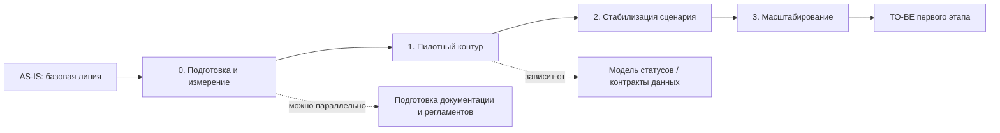

# migration-roadmap.md — roadmap инкрементальной миграции

> Назначение документа: показать безопасный путь от AS-IS к TO-BE через промежуточные состояния, зависимости, риски, условия остановки и критерии завершения этапов.

## 0. Паспорт roadmap

| Поле | Значение |
|---|---|
| Название проекта | `Рефакторинг RetailCore` |
| Связанный документ трансформации | `transformation.md` |
| Горизонт планирования | `пилот` |
| Выбранная стратегия миграции | `<Big Bang / Parallel Run / Incremental Migration / комбинация>` |
| Ключевые паттерны | `ACL + Event-Driven + Database Decomposition` |
| Автор | `Буримский Иван Андреевич, архитектор` |
| Дата | `30.06.2026` |
| Версия | `v1.0` |

## 1. Краткое резюме roadmap

Опишите в 5–7 предложениях, почему выбран именно такой порядок миграции. Покажите, какие зависимости диктуют последовательность этапов и где находятся самые рискованные переходы.

**Шаблон формулировки:**

> Миграция выполняется инкрементально, потому что важна `стабильность платформы и важно не задеть order-flow`. Сначала команда `договаривается о единой модели бизнес событий и новых статусных моделях заказов`, `затем начинаем внедрение с использованием ACL`, после этого как `пользователи будут приходить меньше с вопросами о статусе заказов` и только затем `выносим промо-логику, чтение статусов, выбор маршрутов`. Такой порядок выбран из-за зависимостей: `Status Management`, `Pricing & Promo Logic`, `Delivery routing`. Основные риски roadmap связаны с `влиянием на order-flow`, поэтому для каждого этапа заданы критерии готовности и условия остановки.

## 2. Стартовое и целевое состояние

| Состояние | Описание | Ключевые ограничения | Метрики / признаки состояния |
|---|---|---|---|
| AS-IS | Монолитное ядро, единая БД с частью бизнес-логики | Много обращений в поддержку, долгое время обработки одной заявки, влияние аналитики на БД (особенно в пики), долие запуски новых продуктовыйх фичей | Число обращение, время обработки одной заявки, нагрузка на базу в пики, ТТМ запуска нового продукта |
| Переработанные статусные модели | Пользователи меньше обращаются в поддержку, поддержка быстрее расследует статус заказа | Единая БД, сложность масштабирования | Число обращение, время обработки одной заявки |
| Вынос аналитики в отдельную БД, введение единой модели бизнес-событий | Делать сложные аналитические нагрузки даже во время пиковых нагрузок | Сложный запуск новых бизнесовых доработок | Нагрузка на БД в пики |
| TO-BE первого этапа | Из монолита вынесены некоторые вспомогательные компоненты, частично вынесены данные в отдельные БД. Единая модель бизнес событий. Проработанная статусная модель заказа. | В БД есть бизнес логика | ТТМ |

## 3. Принципы построения roadmap

Зафиксируйте правила, по которым выстроен порядок этапов.

- **Сначала измеряем, потом меняем:** `<какие метрики нужно собрать до миграции>`.
- **Сначала изолируем риск, потом расширяем сценарий:** `<какую зависимость нужно обернуть / ослабить>`.
- **Сначала управляемый пилот, потом масштабирование:** `<какие границы пилота нужны>`.
- **Сначала модель состояний, потом коммуникация:** `<какие статусы должны быть согласованы>`.
- **Сначала реестр потребителей данных, потом декомпозиция:** `<какие зависимости по данным нужно найти>`.

## 4. Roadmap миграции

| Этап | Цель | Промежуточное состояние | Основные работы | Зависимости | Риски | Критерии завершения |
|---|---|---|---|---|---|---|
| AS-IS | Зафиксировать стартовую точку | `<описание>` | `<что собираем / описываем>` | `—` | `<риски неизвестности>` | `<базовая линия подтверждена>` |
| 0. Подготовка и измерение | `<цель>` | `<состояние после подготовки>` | `<работы>` | `<что должно быть известно>` | `<риски>` | `<готовность>` |
| 1. Пилотный контур | `<цель>` | `<первый работающий контур>` | `<работы>` | `<этап 0 / компоненты / данные>` | `<риски>` | `<готовность>` |
| 2. Стабилизация сценария | `<цель>` | `<стабильное промежуточное состояние>` | `<работы>` | `<этап 1 / статусы / мониторинг>` | `<риски>` | `<готовность>` |
| 3. Расширение / масштабирование | `<цель>` | `<расширенный контур>` | `<работы>` | `<стабильность этапа 2>` | `<риски>` | `<готовность>` |
| TO-BE первого этапа | Проверить достижение целевого состояния | `<описание TO-BE>` | `<финальные проверки>` | `<завершённые этапы>` | `<остаточные риски>` | `<целевые метрики достигнуты>` |

## 5. Детализация этапов

Скопируйте блок для каждого этапа roadmap.

### Этап `<номер и название>`

| Раздел | Содержание |
|---|---|
| Цель этапа | `<какой результат должен быть достигнут>` |
| Какие точки трансформации закрывает | `<точки из transformation.md>` |
| Что меняется в процессе | `<изменения для пользователей / операторов / поддержки>` |
| Что меняется в архитектуре | `<новые компоненты, интеграции, данные>` |
| Что не меняется | `<границы этапа>` |
| Входные условия | `<что должно быть готово до старта>` |
| Выходные условия | `<что должно быть готово для завершения>` |
| Метрики этапа | `<метрики>` |
| Риски этапа | `<риски>` |
| Условие остановки | `<когда этап нельзя продолжать>` |

## 6. Зависимости между этапами

Опишите зависимости не только текстом, но и схемой. Если этап можно выполнять параллельно, покажите это явно.

### 6.1. Таблица зависимостей

| Зависимость | Почему порядок жёсткий | Что будет, если нарушить порядок | Как контролируем |
|---|---|---|---|
| `<этап X до этапа Y>` | `<обоснование>` | `<последствие>` | `<контроль>` |
| `<этап X до этапа Y>` | `<обоснование>` | `<последствие>` | `<контроль>` |
| `<этапы можно параллельно>` | `<почему нет жёсткой зависимости>` | `<что нужно синхронизировать>` | `<контроль>` |

## 7. Управление рисками roadmap

Риск должен быть встроен в этап, а не вынесен только в конец документа. Для каждого риска укажите контроль и условие остановки.

| Этап | Риск | Вероятность | Влияние | Контроль | Условие остановки | Владелец |
|---|---|---:|---:|---|---|---|
| `<этап>` | `<риск>` | `<низкая / средняя / высокая>` | `<низкое / среднее / высокое>` | `<как контролируем>` | `<когда останавливаем>` | `<роль>` |
| `<этап>` | `<риск>` | `<низкая / средняя / высокая>` | `<низкое / среднее / высокое>` | `<как контролируем>` | `<когда останавливаем>` | `<роль>` |

## 8. Метрики и контрольные точки

| Контрольная точка | Когда проверяем | Что проверяем | Целевой порог | Источник данных | Решение по результату |
|---|---|---|---:|---|---|
| `<точка>` | `<дата / этап>` | `<метрика / состояние>` | `<порог>` | `<лог / дашборд / отчёт>` | `<продолжить / остановить / откатить / уточнить>` |
| `<точка>` | `<дата / этап>` | `<метрика / состояние>` | `<порог>` | `<лог / дашборд / отчёт>` | `<продолжить / остановить / откатить / уточнить>` |

## 9. Промежуточные состояния

Промежуточное состояние должно быть работоспособным. Нельзя планировать этап, после которого система находится в неопределённом или неподдерживаемом виде.

| Промежуточное состояние | Что уже работает | Что ещё остаётся в легаси | Как пользователь видит сценарий | Как поддержка видит сценарий | Основные риски |
|---|---|---|---|---|---|
| `<состояние 1>` | `<работает>` | `<остаётся>` | `<видит>` | `<видит>` | `<риски>` |
| `<состояние 2>` | `<работает>` | `<остаётся>` | `<видит>` | `<видит>` | `<риски>` |

## 10. Связь roadmap с cutover-планами

| Ключевой переход | На каком этапе | Почему нужен отдельный cutover-plan | Связанный файл |
|---|---|---|---|
| `<переход>` | `<этап>` | `<почему рискованный>` | `cutover-plan.md` |
| `<переход>` | `<этап>` | `<почему рискованный>` | `<другой cutover-plan>` |

## 11. Открытые вопросы

| Вопрос | Почему важен | Кто должен ответить | Срок | Что делаем, если ответа нет |
|---|---|---|---|---|
| `<вопрос>` | `<обоснование>` | `<роль>` | `<дата>` | `<действие>` |
| `<вопрос>` | `<обоснование>` | `<роль>` | `<дата>` | `<действие>` |

## 12. Проверка качества roadmap

Перед сдачей проверьте, что:

- [ ] roadmap связан с точками трансформации из `transformation.md`;
- [ ] есть стартовое состояние, промежуточные состояния и TO-BE;
- [ ] порядок этапов объяснён зависимостями, а не просто перечислен;
- [ ] для каждого этапа указаны цель, работы, риски и критерии завершения;
- [ ] риски имеют контроль и условия остановки;
- [ ] метрики позволяют понять, стало ли лучше;
- [ ] ключевой рискованный переход вынесен в отдельный `cutover-plan.md`;
- [ ] roadmap не требует «идеального будущего» для запуска первого полезного этапа.